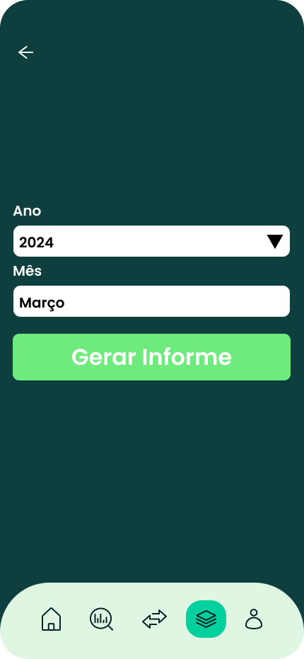

# Informações do Projeto
`TÍTULO DO PROJETO`  

**FINNY**

`CURSO` 

**ENGENHARIA DE SOFTWARE**

## Participantes

Membros:
* Sol Quaresma Crisóstomo
* Gabriel Azeredo Ramos Souza
* Henrique Moreira Gomes de Carvalho
* Marcos Henrique Aguiar França
* Matheus Ruas Gazire Xavier
* Nícolas Araújo Fonseca Pimenta

# Estrutura do Documento

- [Informações do Projeto](#informações-do-projeto)
  - [Participantes](#participantes)
- [Estrutura do Documento](#estrutura-do-documento)
- [Introdução](#introdução)
  - [Problema](#problema)
  - [Objetivos](#objetivos)
  - [Justificativa](#justificativa)
  - [Público-Alvo](#público-alvo)
- [Especificações do Projeto](#especificações-do-projeto)
  - [Personas e Mapas de Empatia](#personas-e-mapas-de-empatia)
  - [Histórias de Usuários](#histórias-de-usuários)
  - [Requisitos](#requisitos)
    - [Requisitos Funcionais](#requisitos-funcionais)
    - [Requisitos não Funcionais](#requisitos-não-funcionais)
  - [Restrições](#restrições)
- [Projeto de Interface](#projeto-de-interface)
  - [User Flow](#user-flow)
  - [Wireframes](#wireframes)
- [Metodologia](#metodologia)
  - [Divisão de Papéis](#divisão-de-papéis)
  - [Ferramentas](#ferramentas)
  - [Controle de Versão](#controle-de-versão)
- [**############## SPRINT 1 ACABA AQUI #############**](#-sprint-1-acaba-aqui-)
- [Projeto da Solução](#projeto-da-solução)
  - [Tecnologias Utilizadas](#tecnologias-utilizadas)
  - [Arquitetura da solução](#arquitetura-da-solução)
- [Avaliação da Aplicação](#avaliação-da-aplicação)
  - [Plano de Testes](#plano-de-testes)
  - [Ferramentas de Testes (Opcional)](#ferramentas-de-testes-opcional)
  - [Registros de Testes](#registros-de-testes)
- [Referências](#referências)

# Introdução

## Problema

A gestão financeira é uma questão muito ampla, que contém dentro de si diversos problemas. Seja gerir entradas e saídas de dinheiro, acompanhar o balanço financeiro mês a mês, planejar investimentos e tantos outros desafios. Esse problema pode ser abordado de diversas formas, e há diversas formas de colocar as finanças em dia, mas como estamos em um contexto de engenharia de software, optamos por uma abordagem tecnológica, para uso doméstico ou em pequenas empresas.

## Objetivos

Nossa finalidade é descomplicar a gestão financeira, e o faremos através de uma solução de software.

Para atingir esse objetivo nós vamos:
* Facilitar acompanhamento de entradas e saídas de dinheiro.
* Orientar com investimentos.
* Disponibilizar informes e conteúdos educativos sobre finanças.

## Justificativa

Nosso sistema vem da necessidade por maior controle e ciência das finanças, assim como a falta de direcionamento com relação a investimentos. Esses pontos foram identificados por meio da entrevistas e pesquisas (usando o google forms) que colocaram em evidência alguns pontos importantes:

* A maioria dos entrevistados não são versados em questões fiscais, investimentos e juros.
* A maioria dos entrevistados não investe.
* A maioria dos entrevistados tem dificuldade em gerenciar gastos e definir orçamentos.

Esses dados coletados colocam em evidência a necessidade de uma solução que consiga educar os usuários sobre assuntos relacionados às finanças, facilitar investimentos, e prover uma forma de gerenciar gastos e orçamentos.

## Público-Alvo

O público alvo do nosso sistema é definido por algumas questões-chave:

* Abertura para usar uma nova ferramenta totalmente digital para controle das finanças
* Familiaridade com tecnologia e a web
* Necessidade de controlar seu dinheiro (ou seja, não ter dinheiro em abundância)
* Falta de estabilidade e/ou necessidade de mais segurança

Tendo isso em vista, colocamos nosso principal público alvo como:
* Jovens
* Estudantes
* Pequenos Empreendedores (MEI especialmente)
* Investidores iniciantes
* Profissionais CLT
* Profissionais Liberais

# Especificações do Projeto

Nessa seção se encontra a especificação do projeto. Para chegar nos dados apresentados, utilizamos o processo de Design Thinking e conceitos do framework Scrum.
## Personas e Mapas de Empatia

## Histórias de Usuários

Com base na análise das personas forma identificadas as seguintes histórias de usuários:

|EU COMO... `PERSONA`| QUERO/PRECISO ... `FUNCIONALIDADE`               |PARA ... `MOTIVO/VALOR`                                              |
|--------------------|--------------------------------------------------|---------------------------------------------------------------------|
|Usuário típico      | Cadastrar minhas movimentações financeiras       | Saber pra onde vai meu dinheiro                                     |
|Usuário típico      | Acompanhar meu saldo X minhas despesas           | Poder planejar meus gastos futuros                                  |
|Usuário típico      | Ver gráficos que ilustrem meus gastos            | Entender a relação gastos x saldo                                   |
|Usuário típico      | Simular investimentos                            | Prever meus rendimentos e me planejar                               |
|Usuário típico      | Me instruir sobre finanças                       | Entender os processos e termos técnicos                             |
|Usuário típico      | Sugerir conteúdos sobre finanças para a aplicação| Auxiliar o aprendizado de outros usuários                           |
|Usuário típico      | Definir entradas e saídas recorrentes            | Não cadastrar a mesma movimentação todo mês                         |
|Usuário típico      | Saber o melhor investimento para mim             | Não escolher investimentos ruins                                    |
|Usuário típico      | Gerar informes financeiros de cada mês           | Manter arquivos para consultas futuras                              |
|Usuário típico      | Consultar resumos das finanças na aplicação      | Ter acesso às informações em grande volume e de forma rápida        |
|Usuário típico      | Receber alertas de pagamentos pendentes          | Não me esquecer de pagar despesas importantes                       |
|Usuário típico      | Categorizar meus gastos                          | Definir e organizar o que posso ou não retirar do orçamento         |

## Requisitos

As tabelas que se seguem apresentam os requisitos funcionais e não funcionais que detalham o escopo do projeto.

### Requisitos Funcionais

|ID    | Descrição do Requisito  | Prioridade |
|------|-----------------------------------------|----|
|RF-001| Cadastro de movimentações financeiras | ALTA | 
|RF-002| Tela de acompanhamento de saldo X despesas | ALTA | 
|RF-003| Simnular investimentos | ALTA | 
|RF-004| Aba de educação sobre finanças | MÉDIA | 
|RF-005| Controle de pagamentos pendentes | MÉDIA | 
|RF-006| Sugestão de investimentos | MÉDIA | 
|RF-007| Sugerir conteúdos sobre finanças para o site | BAIXA | 
|RF-008| Definir Entradas e saídas recorrentes | MÉDIA | 
|RF-009| Informes financeiros mensais | MÉDIA | 
|RF-010| Categorizar despesas | MÉDIA | 
|RF-011| Controle de Metas Financeiras | MÉDIA | 
|RF-012| Visualizar Gráficos Ilustrativos | ALTA | 

### Requisitos não Funcionais

|ID     | Descrição do Requisito  |Prioridade |
|-------|-------------------------|----|
|RNF-001| O sistema deve ser responsivo para rodar em um dispositivos móvel | MÉDIA | 
|RNF-002| As interfaces devem seguir os protótipos |  BAIXA | 

## Restrições

O projeto está restrito pelos itens apresentados na tabela a seguir.

|ID| Restrição                                             |
|--|-------------------------------------------------------|
|01| O projeto deverá ser entregue até o final do semestre |
|02| Não pode ser desenvolvido um módulo de backend        |
|03| O sistema não consegue interagir diretamente com sistemas de bancos |
|04| As informações do usuário serão persistentes somente para o mesmo |

# Projeto de Interface

Aqui segue o projeto de interfaces. Usamos templates de gestão financeira como base para a nossa organização, e os protótipos foram feitos na plataforma Figma.
## User Flow

## Wireframes

# Metodologia

Para o desenvolvimento do projeto utilizamos o framework de Design Thinking, e para a gestão de projetos usamos o SCRUM.

No processo de Design Thinking cumprimos as etapas de Entendimento e Exploração. 
Na etapa de Entendimento conseguimos explorar possibilidades relacionadas à Gestão Financeira, expandimos nosso conhecimento sobre o tema, realizamos pesquisas e entrevistas e montamos personas.
Na etapa de Exploração definimos ideias e possíveis soluções para nossos clientes, e conseguimos mapear quais seriam mais ou menos proveitosas, com base em uma razão de Custo X Impacto.

Para a gestão de projetos, vamos utilizar o SCRUM, com reuniões de planejamento semanais, e acompanhamento diário feito de forma assíncrona. O controle das histórias de usuários e backlog será feito pelo Github.

## Divisão de Papéis

Nossa divisão de papéis é a seguinte

* Tech Lead e Scrum Master: Sol Quaresma Crisóstomo
* Desenvolvedores: Gabriel Azeredo Ramos Souza, Henrique Moreira Gomes de Carvalho, Marcos Henrique Aguiar França, Matheus Ruas Gazire Xavier, Nícolas Araújo Fonseca Pimenta.

## Ferramentas

| Ambiente  | Plataforma              |Link de Acesso |
|-----------|-------------------------|---------------|
|Processo de Design Thinking  | Miro |  https://miro.com/app/board/uXjVNiWnpHo=/ | 
|Repositório de código | GitHub | https://github.com/ICEI-PUC-Minas-PMGES-TI/pmg-es-2024-1-ti1-2401100-g9-gestao-financeira | 
|Protótipo Interativo | Figma | https://www.figma.com/file/IhMlhluGKRTQhptgQpF5GZ/Project-G9?type=design&node-id=0%3A1&mode=design&t=2sgymf9iEOgLq3IT-1 | 

As ferramentas empregadas no projeto são:
- VS Code (Editor de código).
- Discord (Comunicador).
- Figma (Diagramador).
- Heroku (Hospedagem).
- Git (Versionamento).
- Github (Repositório de código).
 
O editor de código foi escolhido porque ele possui uma integração com o sistema de versão (Git).
As ferramentas de comunicação utilizadas possuem integração semelhante e por isso foram selecionadas.
Por fim, para criar diagramas utilizamos essa ferramenta por melhor captar as necessidades da nossa solução.

## Controle de Versão

 A ferramenta de controle de versão adotada no projeto foi o
 [Git](https://git-scm.com/), sendo que o [Github](https://github.com)
 foi utilizado para hospedagem do repositório `upstream`.
 
 O projeto segue a seguinte convenção para o nome de branchs:
 
 - `master`: versão estável já testada do software
 - `unstable`: versão já testada do software, porém instável
 - `testing`: versão em testes do software
 - `dev`: versão de desenvolvimento do software
 
 Quanto à gerência de issues, o projeto adota a seguinte convenção para
 etiquetas:
 
 - `bugfix`: uma funcionalidade encontra-se com problemas
 - `enhancement`: uma funcionalidade precisa ser melhorada
 - `feature`: uma nova funcionalidade precisa ser introduzida

# Projeto da Solução
## Diagrama de Fluxo
Abaixo o diagrama de fluxo com o caminho a ser percorrido pelo usuário final do site.

## Wireframes

## Logo

Ao entrar em nosso aplicativo, você é recebido pela nossa logo distintiva.

## Pagina de apresentação 

Após isso, o usuário inicialmente visualiza a página de boas-vindas que contém um pequeno texto de apresentação da aplicação e as opções de logar ou criar conta.

## Cadastro 

Para realizar o primeiro acesso na aplicação, o usuário precisa efetuar o cadastro com seus dados pessoais.

## Login 

Na tela login é possivel acessar a aplicação com um e-mail e senha pré-cadastrado.

## Home 

Na página home, oferecemos aos usuários uma experiência centralizada, onde podem acessar todo o conteúdo do aplicativo e gerenciar suas finanças de forma conveniente.

## Informes Financeiros

Na tela de informes financeiros, oferecemos aos usuários a capacidade de escolher as datas e valores para lançar no seu registro geral. 

## Metas
Aqui, você pode visualizar um exemplo de como serão organizados todos os registros relacionados à suas metas, incluindo porcentagem de qusnto falta para atingir tal meta, editala, e cadastra nova meta ou exclui-la.

## Pagamento Pendente
Aqui, você pode visualizar uma tela com pagamentos pendentes, pagamentos a serem feitos.

## Sujestao de Conteudo
Aqui, você pode visualizar uma tela de sujestao de conteudo, para a qual possamos ir atualizando com o tempo a nossa pagina com contúdos que os usuarios possam assistir e aprender mais sobre.

## Simular Investimento
Aqui, você pode visualizar um exemplo de como serão organizados a sua simulaçào de investimentos.

## Tecnologias Utilizadas

### Tecnologias Utilizadas no Finny
O Finny foi desenvolvido utilizando as seguintes tecnologias:

### Front-end:

HTML5: Linguagem base para estruturação das páginas da web.
CSS3: Linguagem para estilização visual das páginas da web, garantindo uma interface amigável e responsiva.
Bootstrap 5: Framework CSS popular que facilita o desenvolvimento de interfaces consistentes e adaptáveis a diferentes dispositivos.
JavaScript: Linguagem de script para adicionar interatividade e dinamismo às páginas da web, proporcionando uma experiência mais fluida e intuitiva para o usuário.
### Ferramentas de Desenvolvimento:

Visual Studio Code: Editor de código leve e personalizável, ideal para desenvolvimento web.
Git: Sistema de controle de versão para gerenciar o código do projeto de forma eficiente e colaborativa.
GIMP: Software de edição de imagens gratuito e multiplataforma, utilizado para criar os ícones e imagens da interface do aplicativo.
### Arquitetura:

Modelo MVC (Model-View-Controller): Arquitetura de software que separa as responsabilidades do aplicativo em três camadas: modelo (armazenamento de dados), visão (interface do usuário) e controle (lógica de negócios). Essa organização facilita o desenvolvimento, a manutenção e a testabilidade do código.
API RESTful: Interface de programação de aplicativos que segue os princípios REST (Representational State Transfer), permitindo que diferentes sistemas se comuniquem e troquem dados de forma padronizada e eficiente.
### Observações:

O Finny foi desenvolvido com foco em acessibilidade, utilizando cores e contrastes adequados, além de recursos que facilitam a navegação para usuários com deficiências.
As tecnologias mencionadas acima podem sofrer alterações no futuro, de acordo com as necessidades do projeto e as melhores práticas de desenvolvimento.
Diagrama de Fluxo de Usuário:

Considerações Adicionais:

O Finny foi testado em diversos navegadores modernos, como Chrome, Firefox, Edge e Safari, para garantir compatibilidade e bom funcionamento.
O código do Finny segue as melhores práticas de desenvolvimento, utilizando padrões de codificação e documentação para facilitar a leitura e a manutenção do projeto.
Conclusão:

A escolha das tecnologias utilizadas no Finny foi criteriosa e visou garantir um aplicativo robusto, escalável, acessível e fácil de usar. A combinação de tecnologias front-end modernas, ferramentas de desenvolvimento eficientes e uma arquitetura bem definida proporciona uma base sólida para o desenvolvimento e aprimoramento contínuo do Finny.

## Arquitetura da solução

 **Diagrama de Arquitetura**:

 

# Avaliação da Aplicação

......  COLOQUE AQUI O SEU TEXTO ......

> Apresente os cenários de testes utilizados na realização dos testes da
> sua aplicação. Escolha cenários de testes que demonstrem os requisitos
> sendo satisfeitos.

## Plano de Testes

......  COLOQUE AQUI O SEU TEXTO ......

> Enumere quais cenários de testes foram selecionados para teste. Neste
> tópico o grupo deve detalhar quais funcionalidades avaliadas, o grupo
> de usuários que foi escolhido para participar do teste e as
> ferramentas utilizadas.
> 
> **Links Úteis**:
> - [IBM - Criação e Geração de Planos de Teste](https://www.ibm.com/developerworks/br/local/rational/criacao_geracao_planos_testes_software/index.html)
> - [Práticas e Técnicas de Testes Ágeis](http://assiste.serpro.gov.br/serproagil/Apresenta/slides.pdf)
> -  [Teste de Software: Conceitos e tipos de testes](https://blog.onedaytesting.com.br/teste-de-software/)

## Ferramentas de Testes (Opcional)

......  COLOQUE AQUI O SEU TEXTO ......

> Comente sobre as ferramentas de testes utilizadas.
> 
> **Links Úteis**:
> - [Ferramentas de Test para Java Script](https://geekflare.com/javascript-unit-testing/)
> - [UX Tools](https://uxdesign.cc/ux-user-research-and-user-testing-tools-2d339d379dc7)

## Registros de Testes

......  COLOQUE AQUI O SEU TEXTO ......

> Discorra sobre os resultados do teste. Ressaltando pontos fortes e
> fracos identificados na solução. Comente como o grupo pretende atacar
> esses pontos nas próximas iterações. Apresente as falhas detectadas e
> as melhorias geradas a partir dos resultados obtidos nos testes.

# Referências

......  COLOQUE AQUI O SEU TEXTO ......

> Inclua todas as referências (livros, artigos, sites, etc) utilizados
> no desenvolvimento do trabalho.
> 
> **Links Úteis**:
> - [Formato ABNT](https://www.normastecnicas.com/abnt/trabalhos-academicos/referencias/)
> - [Referências Bibliográficas da ABNT](https://comunidade.rockcontent.com/referencia-bibliografica-abnt/)
